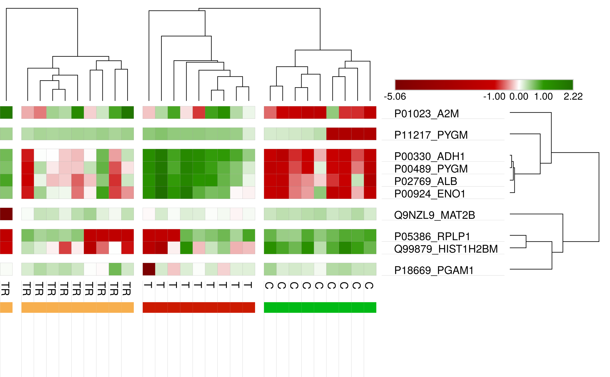

# Evaluation of feature selection and ranking methods' stability in the context of discovery proteomics data

Scripts for the Double Cross Validation described in my thesis.

The script was designed to handle datasets with small number of samples (~50) and bigger number of variables (~800). It uses many classifiers and Heavy feature selection procedures. Considering a laptop with i7: the ranking may take minutes/hours and the prioritization based on small sets of features may take days. In my study, 5 days.

**Please cite** my work, go to [section Citation](#citation)

## Would you like to contribute?

**Any performance and design improvements are welcome!** When my thesis is public available, I will post a link here.

## Figures

The following Figures were some generated by the script and some were build using the .csv files that the scripts output.

## Figure 1
General Pipeline to score the proteins and further rank them using all the information.


## Figure 2
The RFA version developed for my thesis showed to be more Stable and rank better our true biomarkers than the classic RFE method.

If you use RFA or would like to contribute, please refer to its own repository: https://github.com/heberleh/recursive-feature-addition

Please cite my work, go to [section Citation](#citation)


## Figure 3
For each training data set (color), count the number of times that a Protein appeared as top-10 in the 40 ranks. The greater is the number of colors and size of bars, more stable is the protein.


## Figure 4
Heatmap showing the highest 50% average scores of each protein for each Train dataset (column).
Some proteins are not selected to be processed using some training sets (columns), or obtain extremely low score (blue).


## Figure 5
Top-10 proteins selected from a rank of good and stable proteins, such as the one in Figure 3.




# Citation

[1] H. Heberle, “Computational methods in Biology: cancer biomarkers, protein networks and lateral gene transfer,” University of São Paulo, 2019.

1. Heberle, H. Computational methods in Biology: cancer biomarkers, protein networks and lateral gene transfer. (University of São Paulo, 2019).

```bibtex
@phdthesis{Heberle2019,
    author = {Heberle, Henry},
    pages = {164},
    school = {University of S{\~{a}}o Paulo},
    title = {{Computational methods in Biology: cancer biomarkers, protein networks and lateral gene transfer}},
    type = {Doctoral Dissertation},
    year = {2019}
}
```


